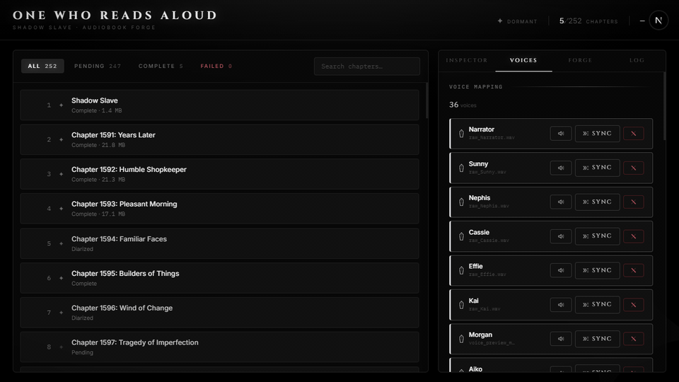

<div align="center">

# Verbatim

**Local audiobook synthesis from any EPUB — per-character voices, per-line emotion, no cloud.**

[](https://python.org)
[](https://nextjs.org)
[](https://fastapi.tiangolo.com)
[](LICENSE)
[](#development)

<br/>



</div>

---

Upload a novel. Walk out with an M4B audiobook where every character has their own cloned voice and every line carries the right emotion — all processed on your own GPU with no API calls, no subscriptions, no data leaving your machine.

## The problem it solves

Most text-to-speech tools treat an entire book as one long string read by one voice. Verbatim reads the novel the way a producer would: identify the cast, assign voices, and deliver each line with the emotion the scene demands. A villain's dialogue sounds different from the narrator. A whispered threat sounds different from a scream.

## How it works

```
EPUB
 │
 ├─ parse ──────────────────────────────── chapters, cover, metadata
 │
 ├─ Casting Director (LLM) ─────────────── Novel Profile draft + character list
 │     └─ [you review & edit in the UI]
 │
 └─ per chapter ────────────────────────── resumable, chapter-gated
       ├─ diarize    (LLM)   assign speaker + emotion to every line
       ├─ synthesize (TTS)   IndexTTS zero-shot voice cloning, 8-dim emotion blend
       └─ assemble   (FFmpeg) silence-padded MP3 → final M4B with chapter markers
```

The LLM and TTS model are **never in VRAM simultaneously**. Each is a context manager: load on entry, `gc.collect()` + cache-clear on exit, nvidia-smi barrier between stages. On a 12 GB card this is the difference between it working and it not working.

## Novel Profile

Every novel has constants that a generic pipeline can't know: who speaks in first person, whether `*italics*` are inner thoughts or stage directions, what `[System: ...]` brackets mean. Instead of hardcoding guesses, Verbatim asks a local LLM to draft a **Novel Profile** from the first few chapters — POV style, thought convention, narrator notes — and surfaces it for editing before any synthesis starts.

This is the architectural centre of the project. The entire pipeline reads from the profile at runtime rather than making its own assumptions.

## Features

- **Zero-shot voice cloning** via IndexTTS — any 5–30 second WAV becomes a character voice
- **8-dimension emotion vectors** mapped from dialogue context (angry, cold, frightened, desperate, …) blended into synthesis at configurable alpha
- **Resumable pipeline** — chapters have a status state machine (`pending → diarized → tts_done → assembled → complete`); a crash or pause picks up exactly where it left off
- **Live progress** over SSE — the UI updates in real time without polling
- **Browser UI** — library view, casting studio for voice assignment, command deck for pipeline control
- **GPU-free test suite** — 124 tests, no model files required; LLM and TTS are injectable seams

## Tech stack

| Layer | Stack |
|---|---|
| Backend | Python 3.11, FastAPI, SQLite, spaCy |
| LLM inference | llama-cpp-python (GGUF, GPU offload) |
| TTS synthesis | IndexTTS (zero-shot voice cloning) |
| Audio | FFmpeg, soundfile |
| Frontend | Next.js 15, React 19, TypeScript, Tailwind CSS |
| Real-time | Server-Sent Events |

## Requirements

- Python 3.11+, Node.js 18+
- FFmpeg on `PATH`
- NVIDIA GPU with ~12 GB VRAM
- [IndexTTS](https://github.com/index-labs/IndexTTS) checkpoints (place under `index-tts/checkpoints/`)
- Any GGUF LLM — Mistral 7B and Llama 3 8B tested

## Getting started

```powershell
git clone https://github.com/ch4ngingstar/verbatim.git
cd verbatim

# Backend
python -m venv .venv
.\.venv\Scripts\pip install -e ".[dev]"
python -m spacy download en_core_web_sm

# Frontend
cd ui && npm install && cd ..

# Start everything
.\start.ps1
```

`start.ps1` handles first-run setup (creates `.env`, `ui/.env.local`, `data/`), launches both servers, and opens the browser. Backend at `:8000`, frontend at `:3000`.

## Configuration

| Variable | Default | Description |
|---|---|---|
| `VERBATIM_DATA_DIR` | `./data` | Root for the SQLite DB, audio, voices, covers |
| `NEXT_PUBLIC_API_URL` | `http://localhost:8000` | Backend URL (copy to `ui/.env.local` too) |

All file paths in the database are stored relative to `VERBATIM_DATA_DIR` — moving the data directory doesn't break anything.

## Using it

1. Open `http://localhost:3000` and upload an EPUB
2. Click **Analyze** — the Casting Director runs the LLM over the first few chapters and returns a draft Novel Profile and character list
3. Edit the profile (POV style, thought convention, narrator notes), add voices from the library, assign them to characters
4. Switch to the Command Deck, provide your model paths, click **Start**
5. Watch chapters process live; pause and resume at any chapter boundary
6. Export the finished M4B when complete

## API

The FastAPI backend at `:8000` — interactive docs at `/docs`.

```
POST   /api/projects                    upload EPUB, create project
GET    /api/projects/{id}               project detail + progress
PATCH  /api/projects/{id}/profile       update Novel Profile
POST   /api/projects/{id}/analyze       run Casting Director

POST   /api/pipeline/start              start pipeline
POST   /api/pipeline/pause|resume|stop  control pipeline
GET    /api/pipeline/status             current state

GET    /api/chapters/{project_id}       chapter list
POST   /api/chapters/{id}/reset         reset to pending

GET    /api/characters/{project_id}     character list
POST   /api/characters/{project_id}     upsert character
PATCH  /api/characters/{id}/voice       assign voice

POST   /api/voices/upload               upload reference clip
GET    /api/voices/{id}/audio           stream reference clip

GET    /api/audio/{chapter_id}          stream chapter MP3
POST   /api/export/m4b                  export full M4B

GET    /api/events                      SSE progress stream
```

## Development

```powershell
# All tests (GPU-free — LLM and TTS are monkeypatched)
.\.venv\Scripts\python -m pytest -v

# Lint + types
.\.venv\Scripts\python -m ruff check .
.\.venv\Scripts\python -m mypy src

# Frontend
cd ui && npm run typecheck && npm test
```

## Project layout

```
src/verbatim/
  db/          StateManager facade — ProjectOps, ChapterOps, CastingOps mixins
  ingest/      EPUB parser, cover extraction, deterministic segmenter
  llm/         LLMDirector context manager, prompt templates
  casting/     CastingDirector — Novel Profile draft from first N chapters
  tts/         TTSEngine, 8-dim emotion vectors, voice map builder
  audio/       chapter assembler (FFmpeg), M4B exporter
  pipeline/    PipelineOrchestrator — VRAM lifecycle, resume logic, SSE events
  api/         FastAPI routes, Pydantic models, pipeline thread wrapper
ui/
  app/         Next.js pages
  components/  CastingStudio, ChapterQueue, CommandStrip, Toasts
  lib/         api.ts, types.ts
```

## License

MIT
